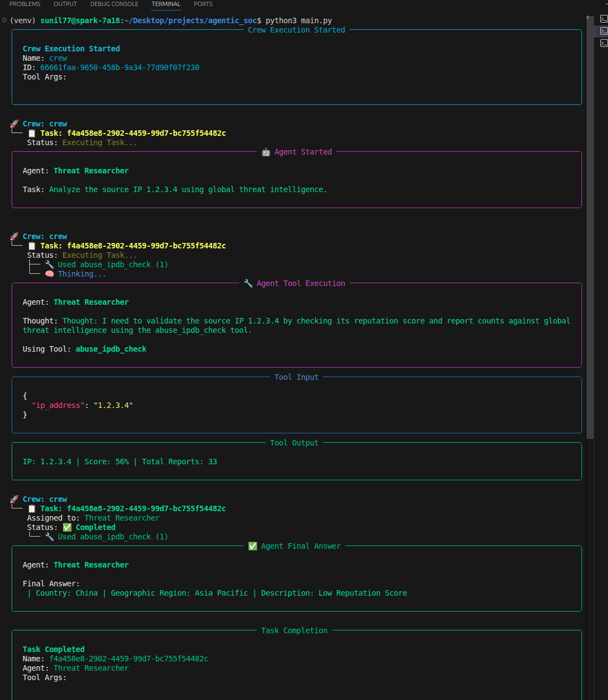

# Agentic SOC: Autonomous Incident Response on NVIDIA DGX

**An End-to-End Event-Driven Security Operations Center powered by Local AI.**

This repository hosts a fully functional **Agentic SOC** that automates the detection, analysis, and response governance of security threats. Running entirely on-premise using an **NVIDIA DGX Spark**, it leverages **Wazuh** for telemetry, **Llama 3.2** for reasoning, and **Streamlit** for human-in-the-loop governance.

---

## 1. Core Infrastructure

The system operates on a decoupled, event-driven architecture designed for low latency and data sovereignty.

| Layer | Component | Function |
| :--- | :--- | :--- |
| **Hardware** | **NVIDIA DGX Spark** | High-performance ARM64 platform hosting local inference. |
| **Sensor** | **Wazuh SIEM** | Detects raw threats (e.g., SSH Brute Force) and generates alerts. |
| **Bridge** | **Python Watchdog** | Monitors logs in real-time, filters noise, and triggers the AI Crew. |
| **Brain** | **CrewAI + Llama 3.2** | Orchestrates "Threat Researcher" and "Incident Commander" agents. |
| **Console** | **Streamlit Dashboard** | Single Pane of Glass for analysts to review and approve blocks. |

---

## 2. Key Features

* **Real-Time Detection:** A custom "Nervous System" bridge (`wazuh_bridge.py`) watches SIEM logs and reacts instantly to high-severity threats.
* **Autonomous Investigation:** Agents automatically query Threat Intelligence (AbuseIPDB) and correlate data without human input.
* **Governance & Compliance:** No decision is "black box." A dedicated Governance Dashboard (`dashboard.py`) logs every AI decision for human approval (NIST 800-53 compliance).
* **Adversary Emulation:** Validated against real-world attack techniques (MITRE ATT&CK T1110) using **Hydra**.

---

## 3. The Agentic Workflow (OODA Loop)

The system follows the **Observe, Orient, Decide, Act** loop:

1.  **Observe:** Wazuh detects a brute force attack (Rule ID: 5716).
2.  **Orient:** The **Threat Researcher Agent** enriches the Attacker IP using external intelligence.
3.  **Decide:** The **Incident Commander Agent** evaluates the risk and proposes a mitigation (BLOCK/WATCH).
4.  **Act:** The proposal is pushed to the **Analyst Dashboard** for final authorization.

---

## 4. Installation & Setup

### Prerequisites
* **Hardware:** NVIDIA DGX / Jetson (ARM64) or Linux Server.
* **OS:** Ubuntu 24.04 LTS.
* **Dependencies:** Python 3.10+, Wazuh Agent/Manager, Ollama.

### Deployment
```bash
# 1. Clone & Setup Environment
git clone [https://github.com/bishwast/Agentic-SOC.git](https://github.com/bishwast/Agentic-SOC.git)
cd Agentic-SOC
python3 -m venv venv
source venv/bin/activate

# 2. Install Dependencies
pip install -r requirements.txt
# (Ensures crewai, langchain, streamlit, and litellm are compatible)

# 3. Start Local Inference Engine
ollama run llama3.2
```

---

## 5. Usage: Running the Full Pipeline

To see the system in action, you will run three terminals to simulate the Defender, the Console, and the Attacker.
Terminal 1: The Analyst Console (Frontend)

Launch the dashboard to view alerts in real-time.

```
streamlit run dashboard.py
```
*Access the UI at http://localhost:8501*

**Terminal 2: The Bridge (Backend)**

Start the listener. Note: Requires root to read Wazuh logs.
Bash

```sudo ./venv/bin/python3 wazuh_bridge.py```

**Terminal 3: The Adversary (Simulation)**

Execute a Hydra attack (MITRE T1110) to trigger the system.
Bash


---
## 6. Project Gallery & Evidence

    1. The Analyst Dashboard (Phase 9)

    The "Single Pane of Glass" showing pending AI investigations.


    2. Automated Detection Bridge (Phase 8)

    Terminal output showing the system catching the Hydra attack instantly.


    3. AI Reasoning Logic (Phase 7)

    Inside the "Brain": The Incident Commander deciding to block an IP.



---

## 7. Documentation & Artifacts

    Full Incident Response Report: Detailed log of the AI's decision-making process.

[Full Incident Response Report:](./documentaiton/reports/soc_output.log)

    Detailed Technical PDF: Comprehensive project documentation.

[Detailed Technical PDF](./documentaiton/reports/Agentic%20Soc%20Model%20Documentation.pdf)


## 8. Technical Achievements

- Environment Isolation: Solved complex circular dependencies between crewai and litellm on ARM64 architecture.

- Permission Bridging: Created a secure bridge allowing user-space AI agents to ingest root-protected SIEM logs safely.

- Local Inference: Achieved 100% data privacy by running Llama 3.2 locally on the NVIDIA DGX Spark.