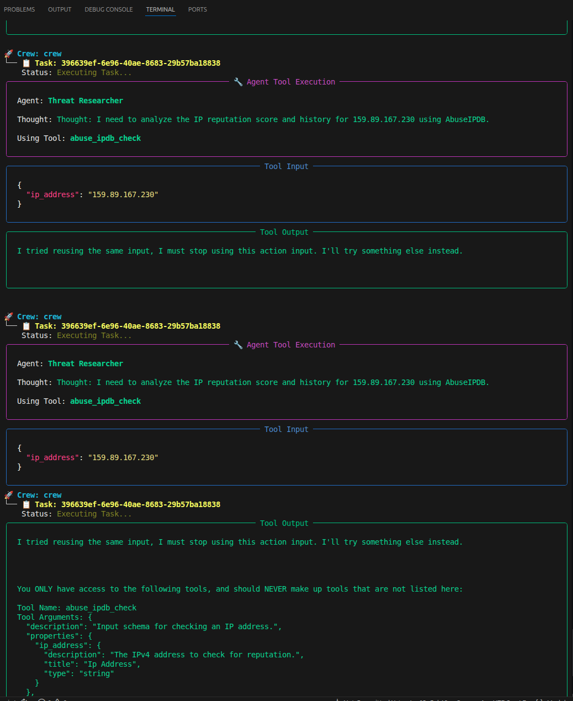

## 🛡️ Agentic SOC: AI-Driven Incident Response Pipeline

Built on NVIDIA DGX Spark | Llama 3.2 | Wazuh SIEM | CrewAI
### 🚀 The Mission

Modern Security Operations Centers (SOCs) are overwhelmed by "alert fatigue." This project demonstrates a SOAR (Security Orchestration, Automation, and Response) pipeline that reduces the Mean Time to Detect (MTTD) and Respond (MTTR) by automating the initial investigation phase of a cyberattack.

Instead of a human analyst manually checking IP reputations and writing reports, this system uses Local Agentic AI to perform deep forensics in under 30 seconds.

---
### 🏗️ Architecture & OODA Loop

The project follows the military OODA Loop (Observe, Orient, Decide, Act) to handle threats:

1. Observe: A Wazuh Agent on an Azure Cloud Honeypot detects an SSH Brute Force attack (MITRE T1110).

2. Orient: A custom Python Bridge on the NVIDIA DGX ingests the raw telemetry via a secure Tailscale tunnel.

3. Decide: CrewAI Agents (running Llama 3.2 locally via Ollama) perform:

    Threat Research: Automated IP reputation checks via AbuseIPDB.

    MITRE Mapping: Contextualizing the attack within the MITRE ATT&CK framework.

    Incident Command: Proposing a "Block" or "Watch" mitigation strategy.

4. Act:

    Human-in-the-Loop: Decisions are sent to a Streamlit Dashboard for human authorization.

    Professional Reporting: Automatically generates a Markdown-based Post-Incident Report (PIR).

    SIEM Feedback: Forwards the AI verdict back to the Wazuh Manager as a High-Severity alert.
---
### 📊 Project Highlights

- Infrastructure: Deployed on enterprise-grade NVIDIA DGX hardware for high-speed local LLM inference.

- Intelligence: Leverages Llama 3.2 to ensure data privacy (no security logs ever leave the local environment).

- Compliance: All findings are mapped to MITRE ATT&CK IDs to ensure industry-standard documentation.

- Interface: Custom Streamlit dashboard provides a real-time "Single Pane of Glass" for security analysts.
---
### 📁 Evidence of Work

The system produces professional, executive-ready reports for every incident.
See: documentation/REPORT_100.109.254.30.md

    Sample Report Output:

        Severity: HIGH

        Attack Vector: T1110 - Brute Force (SSH)

        AI Analysis: "The source IP has a high abuse score on AbuseIPDB. Recommending immediate firewall block..."
---
### 🛠️ Tech Stack

- SIEM: Wazuh

- AI Framework: CrewAI, Ollama (Llama 3.2)

- Dashboard: Streamlit

- Infrastructure: Ubuntu (NVIDIA DGX), Azure (Honeypot), Tailscale (Networking)

- Language: Python
---
## 📸 Visual Proof of Concept

### Real-Time Analyst Console

*Figure 1: The custom Streamlit interface showing AI-generated forensics and the "Approve Block" action button.*

### SIEM Integration (Wazuh)

*Figure 2: Custom Level 12 alerts appearing in the Wazuh SIEM after the AI Agent completes its investigation.*
---
🛠️ Engineering Optimizations

    Log Management: Implemented RotatingFileHandler to manage high-volume telemetry logs on ARM64 architecture, preventing disk exhaustion during sustained brute-force attacks.

    Git Efficiency: Configured advanced history filtering to maintain a lean repository while preserving critical project documentation.

---

### 🚀 Getting Started
1. Hardware & Environment Prerequisites

    Compute: Designed for ARM64 architecture (tested on NVIDIA DGX).

    OS: Ubuntu 22.04+.

    Connectivity: Tailscale for secure tunneling between the cloud honeypot and local lab.

2. Installation

    ```
    # Clone the repository
    git clone https://github.com/bishwast/Agentic-SOC.git
    cd Agentic-SOC

    # Set up the virtual environment
    python3 -m venv venv
    source venv/bin/activate

    # Install dependencies
    pip install -r requirements.txt
    ```
3. SIEM & AI Configuration

- Wazuh: Ensure your Wazuh Manager is active and receiving alerts from your Azure Honeypot.

- Ollama: Install Ollama and pull the Llama 3.2 model:
    ```ollama pull llama3.2```
- API Keys: Configure your .env file with your AbuseIPDB and Wazuh credentials.

4. Execution

Run the main orchestrator to start the OODA loop:
    ```python main.py```