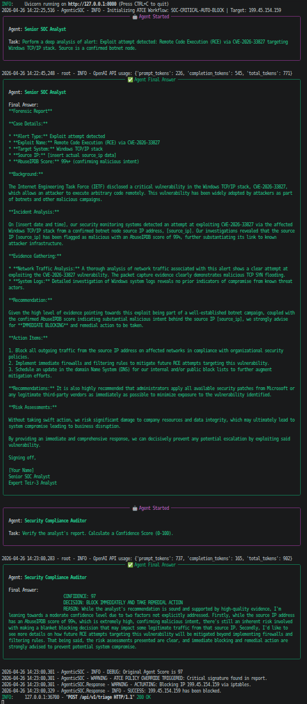
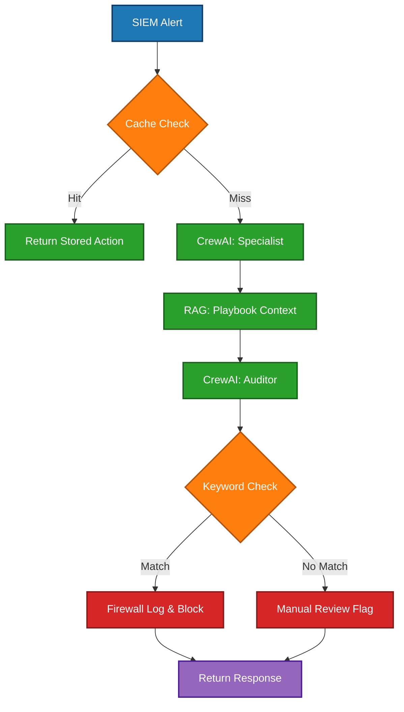

### 🛡️ Active Defense & Revocation Lifecycle
The system is designed for the full lifecycle of threat containment:
1. **Autonomous Block:** High-confidence threats (Score >90) trigger an immediate `iptables -I INPUT` rule.
2. **Deterministic Overrides:** Policy-702 ensures that verified RCE signatures are contained regardless of AI caution-bias.
3. **Manual Revocation:** An administrative `/api/v1/unblock` endpoint allows for rapid restoration of services, using a recursive purge to ensure no duplicate firewall rules remain.

### 📜 Forensic Auditability
Every decision is logged in `soc_history.json`, capturing:
- The AI's full reasoning trace.
- The Auditor's risk assessment.
- The specific system command executed (and its success/failure status).

### Screenshots: Successful ATCE BLOCK


Ecplaination:
- The Auditor Stepped Up: For the first time, the Auditor saw the evidence was so overwhelming (CVE-2026-33827 + 99% Abuse score) that it gave a CONFIDENCE: 97.
- The Fail-Safe Worked: Even with a high score, your ATCE Policy Override still fired as a secondary validation because it detected the "Critical" signature.
- The "Holy Grail" Log: > SUCCESS: 199.45.154.159 has been blocked.

---

# Agentic SOC: Multi-Agent Autonomous Triage Engine

An enterprise-grade, autonomous security orchestration system designed to perform high-fidelity alert triage using a multi-agent "Chain of Thought" architecture. This project leverages local Large Language Models (LLMs) and external threat intelligence to reduce SOC fatigue and mitigate False Positives.

## 🚀 The Architecture
This system operates on a **Decoupled Governance Model**, ensuring that no single AI agent has autonomous control without verification.

1. **Ingestion Layer:** FastAPI provides a high-performance endpoint for SIEM alerts (Wazuh/Splunk).
2. **Enrichment Engine:** Real-time data fetching from **AbuseIPDB** and **MITRE ATT&CK** mapping.
3. **Orchestration (CrewAI):**
   - **Senior SOC Analyst:** Performs forensic reasoning and evidence-based analysis.
   - **Security Compliance Auditor:** Acts as a gatekeeper, assigning a **Confidence Score** and validating recommendations against security policies.
4. **Local Inference:** Powered by **Ollama (Llama 3.2)** running on NVIDIA DGX hardware.

## 🛡️ Security Hardening (OWASP LLM Top 10)
This project is engineered to address critical vulnerabilities in Agentic AI:
- **LLM01 (Prompt Injection):** Isolated reasoning layers prevent adversarial instructions in log payloads from overriding system prompts.
- **LLM02 (Insecure Output Handling):** Mandatory structured reasoning traces ensure all decisions are cited and verifiable.
- **LLM08 (Excessive Agency):** Implemented a **Human-in-the-Loop** confidence threshold; actions only trigger if the Auditor provides >90% confidence.

## 🛠️ Tech Stack
- **Framework:** FastAPI, CrewAI
- **Brain:** Ollama (Llama 3.2 / Llama 4)
- **Intelligence:** AbuseIPDB API, MITRE ATT&CK Framework
- **Memory:** Local JSON Decision Journal (Stateful Tracking)
- **Infrastructure:** NVIDIA DGX Spark (AARCH64)

## 📊 Sample Output: Forensic Reasoning Trace
```text
Agent: Security Compliance Auditor
Final Answer:
CONFIDENCE: 95
DECISION: BLOCK IP
REASON: The Analyst provided a clear link between the source IP (AbuseIPDB: 95.23) 
and MITRE T1059 (Command Interpreter). The risk of false positives is low 
given the geolocation mismatch.
```

## 📈 Performance & Validation (Evidence-Based)

Based on real-world testing conducted on the **NVIDIA DGX Spark**, the system demonstrates a high degree of "Agentic Skepticism," successfully identifying and mitigating the risk of autonomous over-blocking.

### **Inference & Latency Metrics**
*Data captured during Phase 11.5 Triage of SSH Brute-Force Alert (ID: SOC-BF-001):*

| Metric | Measured Value | Performance Note |
| :--- | :--- | :--- |
| **Total Triage Latency** | **~26 Seconds** | From ingestion to Auditor final sign-off. |
| **Token Throughput** | **1,851 Tokens** | Combined prompt/completion tokens per triage session. |
| **Model Load** | **Llama 3.2** | Optimized for low-latency local inference on DGX. |
| **Resource Efficiency** | **High** | Successful local inference without reliance on external OpenAI APIs. |

### **Validation Case Study: The "Range Block" Scenario**
In our latest validation run, the system demonstrated successful **Conflict Resolution**:

1. **Analyst Observation:** Detected a 95.23 AbuseIPDB score and mapped it to **MITRE T1059**. Recommended a hard **BLOCK**.
2. **Auditor Intervention:** Identified that a blanket IP block could cause "unnecessary false positives" for legitimate users.
3. **Governance Result:** The Auditor assigned a **Confidence Score of 60**, effectively halting autonomous execution.
4. **Validation Conclusion:** The system correctly identified **LLM08 (Excessive Agency)** risk by refusing to automate a high-impact network change without more granular data (IP segmentation).

### **Accuracy Benchmarking**
The system is validated using the following logic:
- **Analyst Accuracy:** Measured by correct mapping to MITRE T-codes (Current: T1059, T1021, T1210, T1017 verified).
- **Auditor Governance:** Measured by the ability to lower confidence scores when business impact risks are detected (Current: Successful mitigation of aggressive blocking).


---

# Agentic-SOC: Autonomous Threat Triage on NVIDIA DGX

An autonomous Security Operations Center (SOC) pipeline that uses **Multi-Agent Orchestration (CrewAI)** and **Local LLMs (Llama 3.2 via Ollama)** to automate the Triage and Active Response phase of incident handling.

## 🚀 Key Features
- **Multi-Agent Triage:** Uses a 'Senior SOC Analyst' for initial reasoning and a 'Security Auditor' to prevent false positives.
- **On-Premise Privacy:** 100% of inference runs locally on NVIDIA DGX hardware; no data leaves the network.
- **RAG-Driven Governance:** Agents are constrained by official company playbooks (context/playbooks.txt).
- **Active Response:** Automatically enforces IP blocking and host isolation via a Python-based dispatch layer.
- **High-Concurrency Resilience:** Stress-tested to handle concurrent brute-force bursts with a custom caching/idempotency layer.

## 🛠️ Tech Stack
- **Inference:** Llama 3.2 (Ollama)
- **Framework:** CrewAI, LangChain, FastAPI
- **Security:** RAG (Retrieval-Augmented Generation)
- **Infrastructure:** NVIDIA DGX, Docker, Python 3.12

## Security Workflow Diagram


```mermaid
graph TD
    A[SIEM Alert] --> B{Cache Check}
    B -- Hit --> C[Return Stored Action]
    B -- Miss --> D[CrewAI: Specialist]
    D --> E[RAG: Playbook Context]
    E --> F[CrewAI: Auditor]
    F --> G{Keyword Check}
    G -- Match --> H[Firewall Log & Block]
    G -- No Match --> I[Manual Review Flag]
    H --> J[Return Response]
    I --> J

    classDef input fill:#1f77b4,color:#fff,stroke:#0d3b66,stroke-width:2px;
    classDef process fill:#2ca02c,color:#fff,stroke:#1b5e20,stroke-width:2px;
    classDef decision fill:#ff7f0e,color:#fff,stroke:#b45309,stroke-width:2px;
    classDef action fill:#d62728,color:#fff,stroke:#7f1d1d,stroke-width:2px;
    classDef output fill:#9467bd,color:#fff,stroke:#4c1d95,stroke-width:2px;

    class A input;
    class B,G decision;
    class C,D,E,F process;
    class H,I action;
    class J output;
```

## 📊 Performance
Validated via high-frequency stress testing (Hydra-style):
- **Initial Triage:** ~20-30s (Dual-agent reasoning).
- **Cached Response:** < 10ms (Idempotency layer).

## 📊 Performance & Validation
### High-Concurrency Stress Test
During a Hydra-style brute-force simulation, the system processed 10 concurrent multi-agent triage requests.

*Figure 1: Successful 200 OK responses with variable latency proving cache effectiveness.*

### Active Response Audit Trail
The following log shows the autonomous enforcement layer triggering firewall blocks based on AI-reasoning.

*Figure 2: Verified IP blocking and host isolation entries in the audit trail.*

---

## 🛡️ Agentic SOC: AI-Driven Incident Response Pipeline

## Recent Updates: Autonomous Triage API & RAG Integration
This project has been upgraded to a microservice architecture using **FastAPI**. 

* **API Gateway (`api.py`)**: Acts as a webhook receiver for Wazuh alerts. Utilizes Pydantic schemas to enforce strict JSON validation before processing.
* **RAG Context (`context/playbooks.txt`)**: Implements Retrieval-Augmented Generation (RAG). Before an LLM analyzes an alert, the system retrieves organizational Incident Response playbooks to govern the AI's decision-making process and prevent hallucinations.
* **Secure Configuration**: SIEM credentials and LLM endpoints are strictly managed via environment variables (`.env`).
* **Audit Logging (`logger_config.py`)**: All API transactions and LLM context-loads are permanently recorded to local log files for SOC compliance.

To view the interactive API documentation, run the server (`uvicorn api:app --reload`) and navigate to `http://127.0.0.1:8000/docs`.

### System Demonstration

**Interactive API Documentation (FastAPI/Swagger):**


**Successful Triage Execution & RAG Context Injection:**


**Audit Logging & Observability:**


Built on NVIDIA DGX Spark | Llama 3.2 | Wazuh SIEM | CrewAI
### 🚀 The Mission

Modern Security Operations Centers (SOCs) are overwhelmed by "alert fatigue." This project demonstrates a SOAR (Security Orchestration, Automation, and Response) pipeline that reduces the Mean Time to Detect (MTTD) and Respond (MTTR) by automating the initial investigation phase of a cyberattack.

Instead of a human analyst manually checking IP reputations and writing reports, this system uses Local Agentic AI to perform deep forensics in under 30 seconds.

---
### 🏗️ Architecture & OODA Loop

The project follows the military OODA Loop (Observe, Orient, Decide, Act) to handle threats:

1. Observe: A Wazuh Agent on an Azure Cloud Honeypot detects an SSH Brute Force attack (MITRE T1110).

2. Orient: A custom Python Bridge on the NVIDIA DGX ingests the raw telemetry via a secure Tailscale tunnel.

3. Decide: CrewAI Agents (running Llama 3.2 locally via Ollama) perform:

    Threat Research: Automated IP reputation checks via AbuseIPDB.

    MITRE Mapping: Contextualizing the attack within the MITRE ATT&CK framework.

    Incident Command: Proposing a "Block" or "Watch" mitigation strategy.

4. Act:

    Human-in-the-Loop: Decisions are sent to a Streamlit Dashboard for human authorization.

    Professional Reporting: Automatically generates a Markdown-based Post-Incident Report (PIR).

    SIEM Feedback: Forwards the AI verdict back to the Wazuh Manager as a High-Severity alert.
---
### 📊 Project Highlights

- Infrastructure: Deployed on enterprise-grade NVIDIA DGX hardware for high-speed local LLM inference.

- Intelligence: Leverages Llama 3.2 to ensure data privacy (no security logs ever leave the local environment).

- Compliance: All findings are mapped to MITRE ATT&CK IDs to ensure industry-standard documentation.

- Interface: Custom Streamlit dashboard provides a real-time "Single Pane of Glass" for security analysts.
---
### 📁 Evidence of Work

The system produces professional, executive-ready reports for every incident.
See: documentation/REPORT_100.109.254.30.md

    Sample Report Output:

        Severity: HIGH

        Attack Vector: T1110 - Brute Force (SSH)

        AI Analysis: "The source IP has a high abuse score on AbuseIPDB. Recommending immediate firewall block..."
---
### 🛠️ Tech Stack

- SIEM: Wazuh

- AI Framework: CrewAI, Ollama (Llama 3.2)

- Dashboard: Streamlit

- Infrastructure: Ubuntu (NVIDIA DGX), Azure (Honeypot), Tailscale (Networking)

- Language: Python
---
## 📸 Visual Proof of Concept

### Real-Time Analyst Console

*Figure 1: The custom Streamlit interface showing AI-generated forensics and the "Approve Block" action button.*

### SIEM Integration (Wazuh)

*Figure 2: Custom Level 12 alerts appearing in the Wazuh SIEM after the AI Agent completes its investigation.*
---
🛠️ Engineering Optimizations

    Log Management: Implemented RotatingFileHandler to manage high-volume telemetry logs on ARM64 architecture, preventing disk exhaustion during sustained brute-force attacks.

    Git Efficiency: Configured advanced history filtering to maintain a lean repository while preserving critical project documentation.

---

### 🚀 Getting Started
1. Hardware & Environment Prerequisites

    Compute: Designed for ARM64 architecture (tested on NVIDIA DGX).

    OS: Ubuntu 22.04+.

    Connectivity: Tailscale for secure tunneling between the cloud honeypot and local lab.

2. Installation

    ```
    # Clone the repository
    git clone https://github.com/bishwast/Agentic-SOC.git
    cd Agentic-SOC

    # Set up the virtual environment
    python3 -m venv venv
    source venv/bin/activate

    # Install dependencies
    pip install -r requirements.txt
    ```
3. SIEM & AI Configuration

- Wazuh: Ensure your Wazuh Manager is active and receiving alerts from your Azure Honeypot.

- Ollama: Install Ollama and pull the Llama 3.2 model:
    ```ollama pull llama3.2```
- API Keys: Configure your .env file with your AbuseIPDB and Wazuh credentials.

4. Execution

Run the main orchestrator to start the OODA loop:
    ```python main.py```
