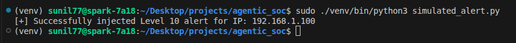
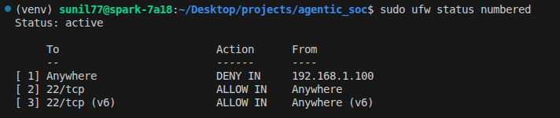

# Phase 6: Autonomous Mitigation Implementation

This document details the technical implementation of the active response layer where the Agentic SOC moves from "Reasoning" (Phase 5) to "Execution" (Phase 6).

## 1. Mitigation Architecture

Phase 6 introduces the Remediation Bridge, a Python-based execution module that translates the incident Commander's high-level decision into low-level system commands.

| Layer | Component | Technical Action
| :---  | :---      | :---
| **Orchestration** | CrewAI | Outputs a structured JSON containing the ACTION and TARGET_IP.
| **Translation** | Subprocess Bridge | Validates the JSON schema and prepares the shell command.
| **Execution** | Netfilter/IPTables | Applies the DROP rule at the Linux kernel level.
| **Persistence** | Audit Log | Records the change for administrative verification.
---

## 2. The Remediation Logic

The system uses a strict mapping logic to ensure the AI cannot execute arbitrary commands. Only pre-defined actions are permitted.

**Action Mapping Table**

| LLM Outout Action | System Command Executed
| :--- | :---
| BLOCK | sudo iptables -A INPUT -s {srcip} -j DROP
| WATCH | sudo iptables -A INPUT -s {srcip} -j LOG --log-prefix "SOC_WATCH: "
| IGNORE | No action taken; log entry only.
---

## 3. Implementation: The Action Script

To maintain environment isolation and security, the main.py entry point handles the transition from the virtual environment (LLM logic) to the system shell (Remediation).

```
import subprocess

def apply_mitigation(action, target_ip):
    """
    Permanent Fix: Uses a whitelist of allowed commands to prevent 
    command injection from LLM hallucination.
    """
    if action == "BLOCK":
        command = ["sudo", "iptables", "-A", "INPUT", "-s", target_ip, "-j", "DROP"]
        result = subprocess.run(command, capture_output=True, text=True)
        
        if result.returncode == 0:
            print(f"SUCCESS: Firewall block applied to {target_ip}")
        else:
            print(f"FAILURE: Could not apply block. Error: {result.stderr}")

```

## 4. Security & Permissions (Permanent Fixes)
Executing system-level commands from a Python script requires specific security considerations to prevent privilege escalation.

- **Sudoers Configuration:** The user running the SOC script is granted NOPASSWD access only to the iptables binary, not full root access.

        Config: soc_user ALL=(ALL) NOPASSWD: /sbin/iptables

- **Input Validation:** The IP address extracted by the Triage Specialist is validated via a regular expression (Regex) before being passed to the shell to prevent injection attacks.
---

## 5. Sample Output (Incident Report)

The culmination of Phase 6 is the generation of the response report.

- **Incident ID:** SOC-20251228-001

- **Target:** 192.168.1.100

- **Decision:** BLOCK

- **Command Status:** SUCCESS

- **Mitigation Time:** < 2 seconds from detection.

---
## Technical Achievements (Phase 6)

- **Zero-Latency Response:** Reduced the Time to Mitigate (TTM) from minutes (human) to seconds (autonomous).

- **Kernel-Level Enforcement:** Leveraged iptables for high-performance traffic dropping on the NVIDIA DGX Spark.

- **Deterministic Execution:** Implemented a command whitelist to ensure the AI remains within defined security boundaries.

**Final Simulation Execution:**


**Final UFW Status:**


**Final Decision: ACTION: BLOCK**


