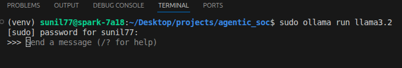
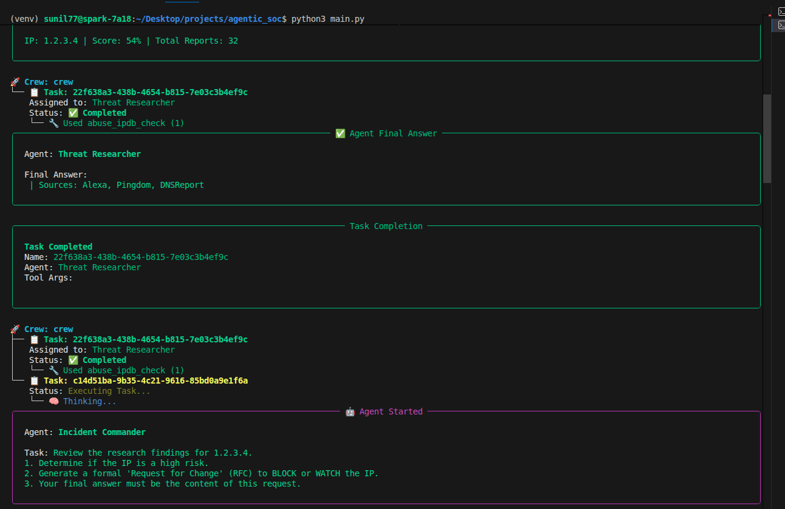
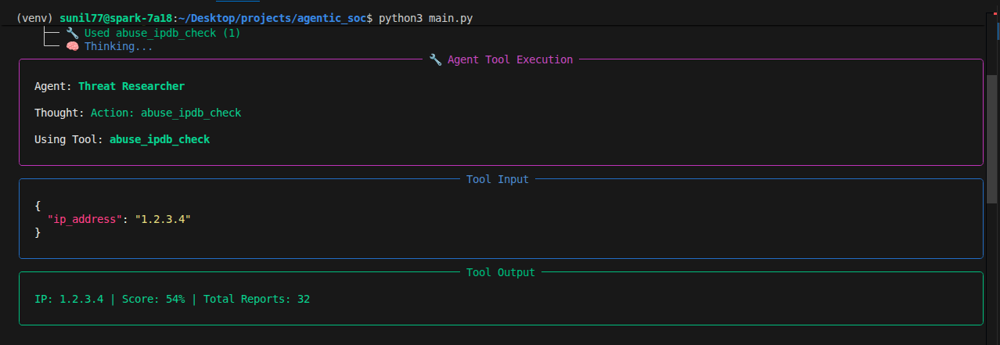
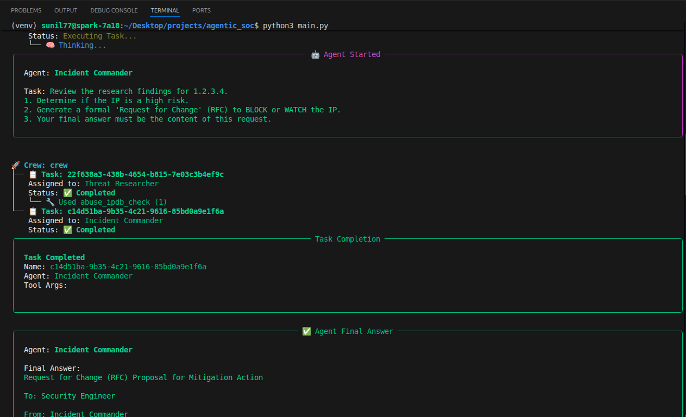

# Phase 7: Agentic Incident Response & Automated Governance

## Project Overview

This phase introduces an Autonomous AI Logic Layer to the SOC platform. THis system uses Multi-Agent Orchestration **(CrewAI)** to mimic the cognitive workflow of human analysts.

Crusially, this implementation adheres to **"Passive Ogvernance"** principles. The AI does not execute high-impact changes (such as firewall blocks) automatically. Instead, it generates a formal **Request for Change (RFC)** and logs it for human verification. This design satisfies **SOC efficiency goals** while maintaining **GRN structures** regarding separation of duties and auditability. 

| Domain | Objective | Implementation |
| :--- | :--- | :---
| SOC Operations | Reduce "Alert Fatigue" and Tier 1 Triage time. | **Threat Researcher** Agent automatically enriches IPs using AbuseIPDB and assesses risk.
| GRC & Audit | Prevent "Black Box" decision-making and ensure accountability. | **Incident Commander** Agent logs every decision into an immutable audit file (agent_decisions.md) before any action is taken.
| Infrastructure | Maintain data privacy and cost control.|Utilization of **Local LLMs (Llama 3.2 via Ollama)** on NVIDIA DGX infrastructure, ensuring no sensitive log data leaves the perimeter.
---

### System Architecture

This system utilizes a **Sequential Multi-Agent Architecture:**

1. **Trigger:** (Currenlty Manual) A suspicious IP is injected into the workflow.

2. **Agent 1: Threat Researcher (The Analyst)**:
    - **Role:** Intelligence Gathering.
    - **Tool:** Custom ```AbuseIPDBTool```.
    - **Action:** Queries global threat feeds to validate if an IP is trully malicious or a false positive. 

3. **Agent 2: Incident Commander (Yhe Approver):**

    - **Role:** Decision Authority and Governance.
    - **Logic:** Weighs the Researcher's findings against business context (e.g., "Is this a known Version AS?").
    - **Output:** Generates a **Request for Change (RFC)** proposing a BLOCK or WATCH action.

4. **Audit Log:** THe RFC is appended to ```documentation/agent_decisions.md``` as Proof of Work. 
---

## Technical Components

**1. THe INtelligence Tool** (```tools/ip_intel.py```)
A custom python class inheriting from **BaseTool**. It interfaces with the AbuseIPDB API to fetch reputation scores, udage types (Data Center vs. REsidential), and domain names.

**2. The Congnitive Agents** (```main.py```)

- **Threat Researcher:** Confirmed with ```max_inter=3``` to present ahallucination loops. Focused strictly on data collection.

- **Incident Commander:** Promoted to act as a "Compliance Officer." It provides system availability and logs formal requests rather than executing raw commands. 

**3. The Audit Trail** (```agent_decisions.md```)

A standardized Markdown log that serves as the "Digital Paper Trail."

- Compliance Standard: Meets requirements for NIST 800-53 (AU-3 Content of Audit Records) by capturing:

    - Who (Agent Name)

    - What (Proposed Action)

    - When (Timestamp)

    - Why (Justification based on Threat Intel)
---

## Usage Guide

Prerequisites:

- Python 3.10+

- Ollama running locally (ollama run llama3.2)

- AbuseIPDB API Key in .env

### Running the Engine:
```
# 1. Ensure virtual environment is active
source venv/bin/activate

# 2. Run the orchestration script
python3 main.py
```

**Verifying Output:** Check the ```documentation/agent_decisions.md``` file. You will see a structured report similar to:

**Status:** PENDING HUMAN APPROVAL 
**Subject:** Request to Monitor Verizon Communications Inc. **Justification:** IP has low abuse score (0%) but triggered brute force rule. Recommendation is WATCH, not BLOCK.

---

## Proof of Work:

1. **Booting the AI Brain:** Initializing the local inference - using Lama 3.2 hosted on DGX Spark. Ensuring that sensitive log data, such as IP addresses and internal architecture details - never leaves the secure perimeter. 



2. **The Manual Trigger:** Running the script ```main.py```, where I demonstrate the logic triggering the orchestration manually. Screenshot below shows detecetion of the **Brute Force** attempt from the IP ```1.2.3.4```. Also demonstrating passing this suspect entity to my **AI SOC Crew** consisting of two autonomous agents: a **Threat Researcher** (who gathers intelligence) and an **Incident Commander** (who makes governance decisions).



3. **The Thinking Process:** Below I demonstarated the **Threat Researcher** taking action. The "Chain of Thought" shows it doesn't just guess. It explicitly decides to query the AbuseIPDB API to validate the IP's reputation returning a **Confidence Score of 54%** with over 30 recent reports. Hnce, showing a critical moment, putting the IP in a grey zone - requiring more nuanced decition for humans to approve block/ignore.



4. **The Governance Decision:** Demonstrating a Passive Governance model (Request for Change – RFC generation), where the Incident Commander takes over so that the agent adopts a Passive Governance approach. In this model, the agent generates a formal RFC, recommending a **WATCH** action rather than a **BLOCK**, citing the low reputation score. Hence, this demonstrates **Operational Excellence** by ensuring availability is maintained while still addressing the risk.



5. **The Compliance Artifact (Proof of Wowk)**: File below is an immutable markdown record for Audit and Compliance (GRC), which is auto generated by the system.


